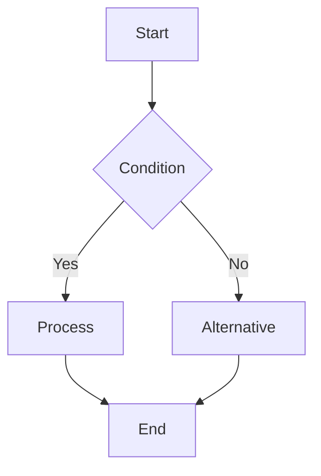
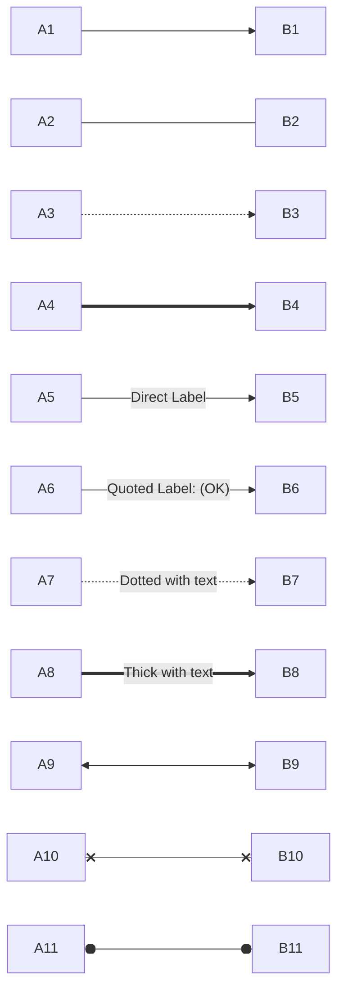
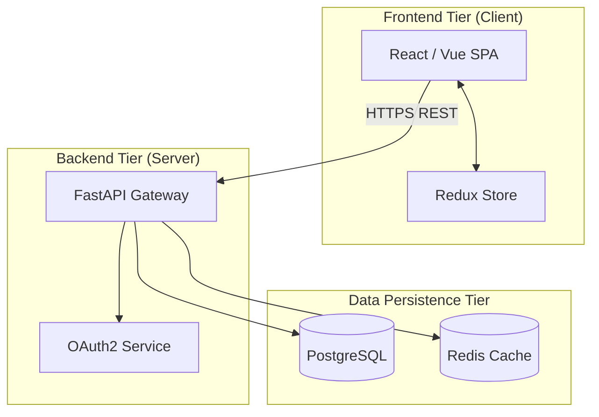
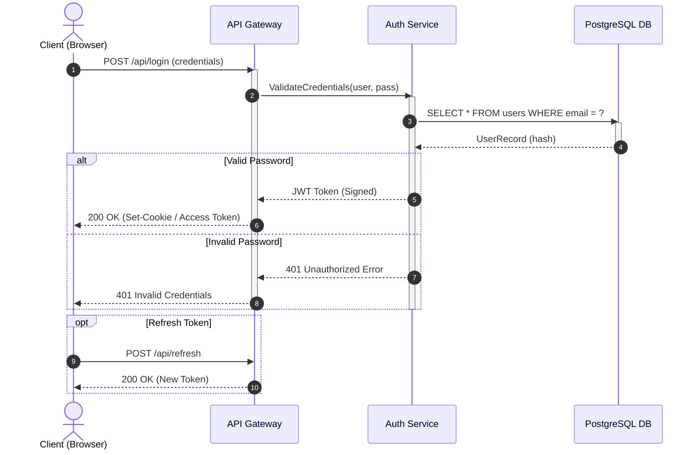
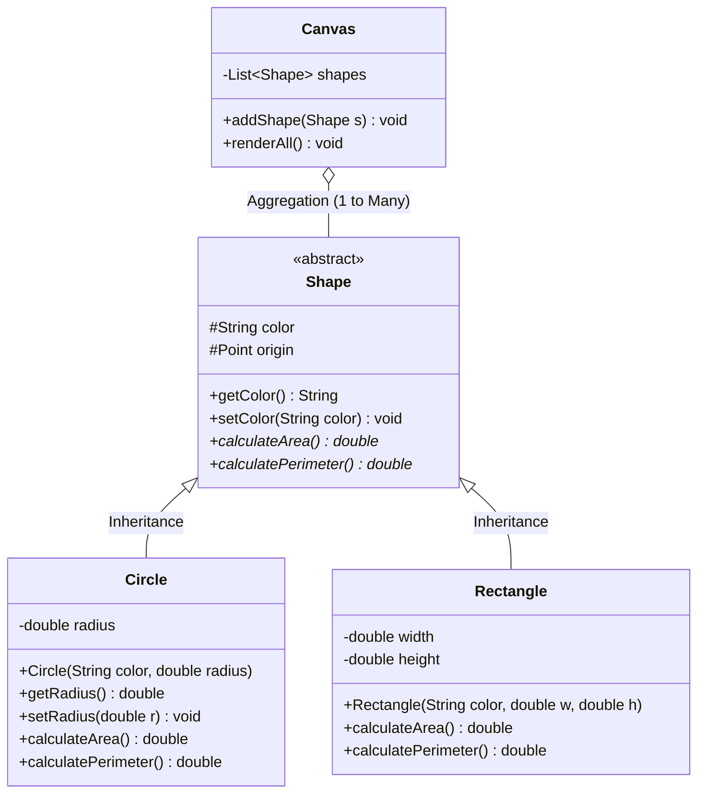
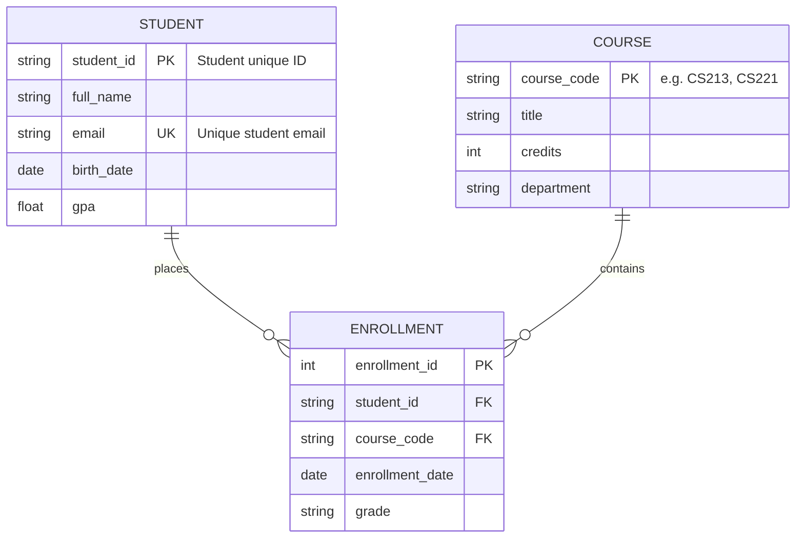
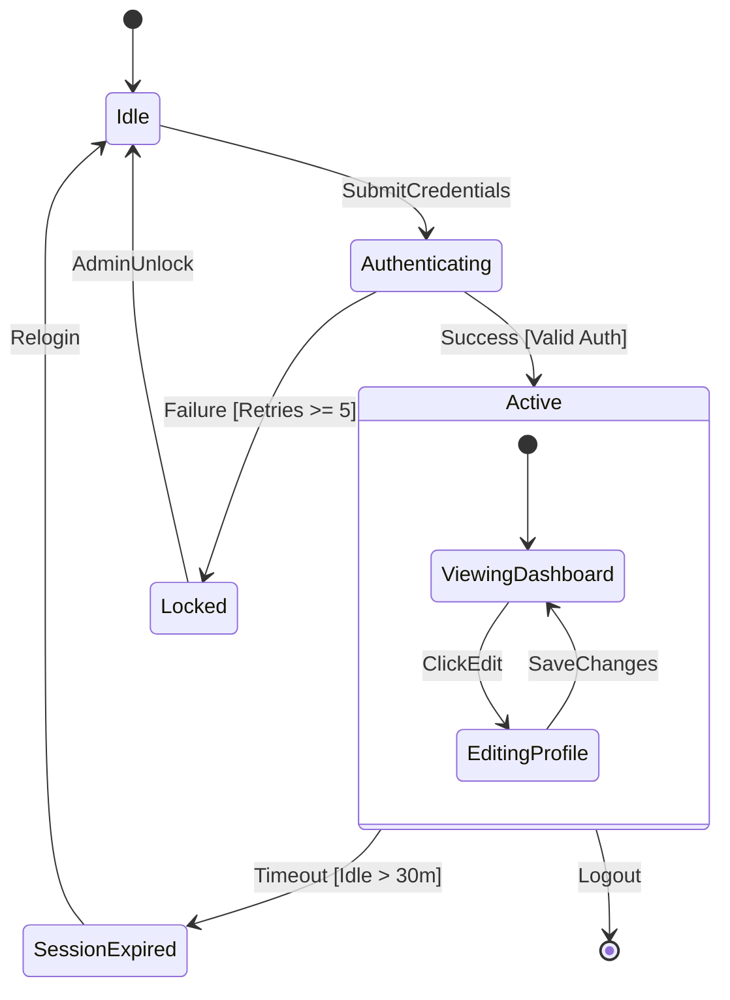
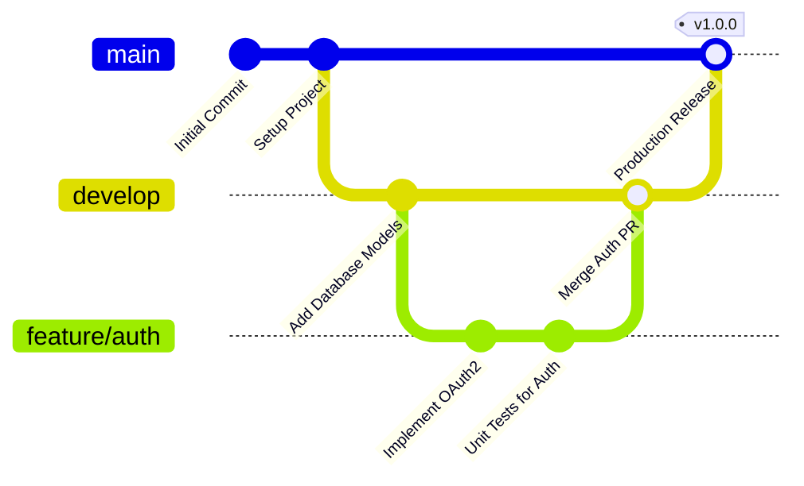

# Mermaid Diagram Specification & Design Patterns Skill

## Purpose
This skill provides comprehensive instructions, code templates, relationship markers, and formatting patterns for writing spec-compliant Mermaid diagrams inside Obsidian notes.

---

## 1. Syntax Foundations & Fencing

All Mermaid diagrams in Markdown must be enclosed in fenced code blocks tagged with `mermaid`:

````markdown

````

### Rules for Obsidian Compatibility:
1. **Node IDs**: Must be alphanumeric without spaces or punctuation (e.g., `userAuthService`, `node_1`). Use display labels for text.
2. **Text Escaping**: Any label containing parentheses `()`, brackets `[]`, braces `{}`, or colons `:` **must be enclosed in double quotes**: `nodeA["Function: processData(x)"]`.
3. **Directional Flow**:
   - `TD` / `TB`: Top-Down / Top-to-Bottom
   - `BT`: Bottom-to-Top
   - `LR`: Left-to-Right
   - `RL`: Right-to-Left

---

## 2. Flowcharts (`flowchart TD` / `flowchart LR`)

### 2.1 Node Shapes

| Shape Name | Syntax | Description |
| :--- | :--- | :--- |
| **Rectangle (Default)** | `id[Text]` | Standard process step |
| **Rounded Rectangle** | `id(Text)` | Start / End / Soft step |
| **Stadium (Pill)** | `id([Text])` | Terminal / Program boundary |
| **Subroutine** | `id[[Text]]` | Predefined process / module |
| **Cylindrical (Database)** | `id[(Database / Storage)]` | Database, cache, or storage |
| **Circle** | `id((Text))` | State / Connector |
| **Asymmetric Flag** | `id>Text]` | Flag / Message trigger |
| **Rhombus (Diamond)** | `id{Decision / Condition}` | Conditional branch |
| **Hexagon** | `id{{Preparation / Loop}}` | Setup, verification, or loop header |
| **Parallelogram** | `id[/Data Input / Output/]` | I/O operation |
| **Trapezoid** | `id[/Manual Operation\]` | User interaction |
| **Inverted Trapezoid** | `id[\Summary / Aggregation/]` | Collated data / aggregation |

### 2.2 Link Styles & Labels



```markdown
A1 --> B1              %% Directed arrow
A2 --- B2              %% Open link (no arrow)
A3 -.-> B3             %% Dotted arrow
A4 ==> B4              %% Thick solid arrow
A5 -->|Direct Label| B5 %% Arrow with text label
A6 -- "Quoted Label" --> B6
A7 -. "Text" .-> B7    %% Dotted arrow with text
A8 == "Text" ==> B8    %% Thick arrow with text
A9 <--> B9             %% Bidirectional arrow
A10 x--x B10           %% Cross-head connection
A11 o--o B11           %% Circle-head connection
```

### 2.3 Subgraphs & Visual Boundaries



### 2.4 Styling & Custom Themes

```markdown
%% Individual Node Styling
style NodeID fill:#2d3748,stroke:#4a5568,stroke-width:2px,color:#ffffff

%% Class Definition & Reusable Styling
classDef primary fill:#2563eb,stroke:#1d4ed8,stroke-width:2px,color:#ffffff;
classDef success fill:#16a34a,stroke:#15803d,stroke-width:2px,color:#ffffff;
classDef warning fill:#d97706,stroke:#b45309,stroke-width:2px,color:#ffffff;

class NodeA,NodeB primary;
NodeC:::success
```

---

## 3. Sequence Diagrams (`sequenceDiagram`)

Used to visualize message passing, API calls, and asynchronous interactions across lifecycles:



### Key Sequence Diagram Operators:
- `->>` : Synchronous request with solid arrow
- `-->>` : Asynchronous reply with dotted arrow
- `-x` / `--x` : Lost message / connection drop
- `activate Component` / `deactivate Component` : Activation bars
- `Note over A,B: Description` : Contextual annotation note
- `alt ... else ... end` : Alternative execution branch
- `opt ... end` : Optional execution branch
- `loop ... end` : Repeated execution loop
- `par ... and ... end` : Parallel concurrent actions

---

## 4. Class Diagrams (`classDiagram`)

Standard UML class diagrams for Object-Oriented software architectures:



### UML Relationships in Mermaid:

| Relationship | Mermaid Syntax | Description |
| :--- | :---: | :--- |
| **Inheritance / Generalization** | `<|--` | Subclass inherits from Superclass (`Derived <|-- Base`) |
| **Realization / Implementation** | `<|..` | Class implements Interface (`ConcreteClass <|.. IInterface`) |
| **Composition** | `*--` | Whole-part relationship where parts cannot exist without the whole |
| **Aggregation** | `o--` | Whole-part relationship where parts have independent lifecycles |
| **Association** | `-->` | Directed relationship (`ClassA --> ClassB`) |
| **Dependency** | `..>` | Temporary usage (`ClassA ..> UtilityService`) |

### Visibility Modifiers:
- `+` : Public
- `-` : Private
- `#` : Protected
- `~` : Package-Private / Internal
- `*` : Abstract method
- `$` : Static member

---

## 5. Entity-Relationship Diagrams (`erDiagram`)

Ideal for relational database schemas and data science models:



### ER Cardinality Notation:

| Left Symbol | Right Symbol | Relationship Meaning |
| :---: | :---: | :--- |
| `\|\|` | `\|\|` | Exactly one to Exactly one ($1:1$) |
| `\|\|` | `o\|` / `\|o` | Exactly one to Zero or one ($1:0..1$) |
| `\|\|` | `o{` / `}o` | Exactly one to Zero or more ($1:N$) |
| `\|\|` | `\|{` / `{\|` | Exactly one to One or more ($1:1..N$) |
| `}o` | `o{` | Zero or more to Zero or more ($M:N$) |

---

## 6. State Diagrams (`stateDiagram-v2`)

Used to visualize finite state machines (FSM), lifecycles, and network protocol states:



---

## 7. Git Graphs (`gitGraph`)

Visualizes branching, commits, tags, and pull request merges:



---

## 8. Common Pitfalls & Troubleshooting Checklist

1. **Avoid Reserved Words in Node IDs**: Never use words like `end`, `subgraph`, `style`, or `class` as raw Node IDs.
2. **Text Wrap & Line Breaks**: Use `<br>` or `
` inside quoted string labels for multi-line node descriptions: `nodeA["First Line<br>Second Line"]`.
3. **Escaping Math in Mermaid**: If embedding math inside Mermaid nodes, write standard text equivalents or wrap LaTeX in clean string literals to prevent parser crashes.
4. **Validating Direction**: Always place the direction statement immediately following the diagram type opener (e.g., `flowchart TD`, not `flowchart
TD`).
